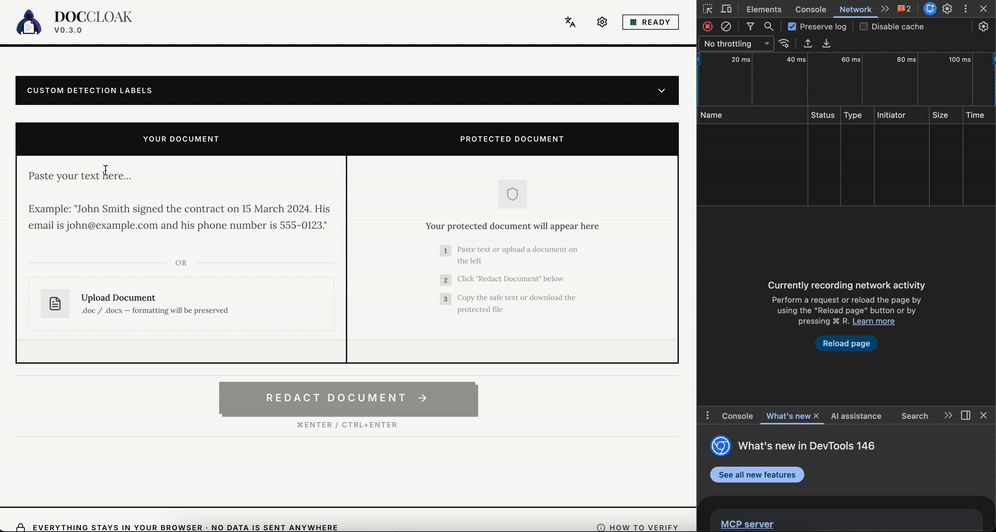
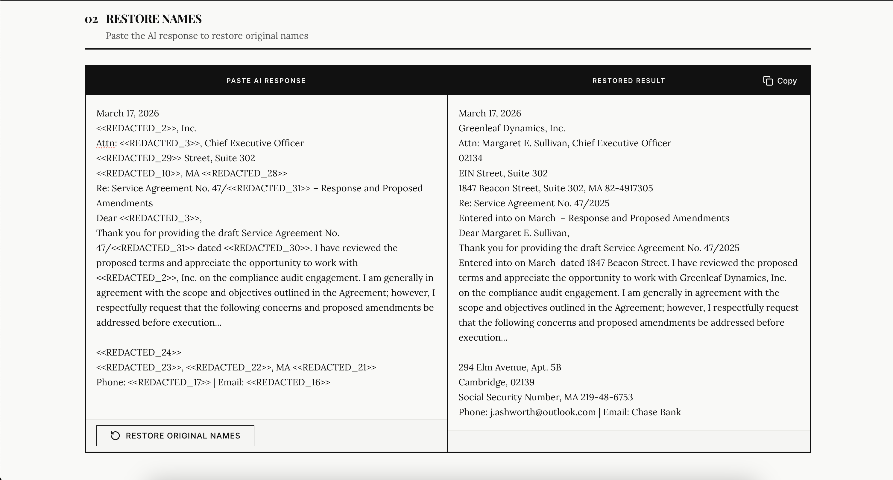
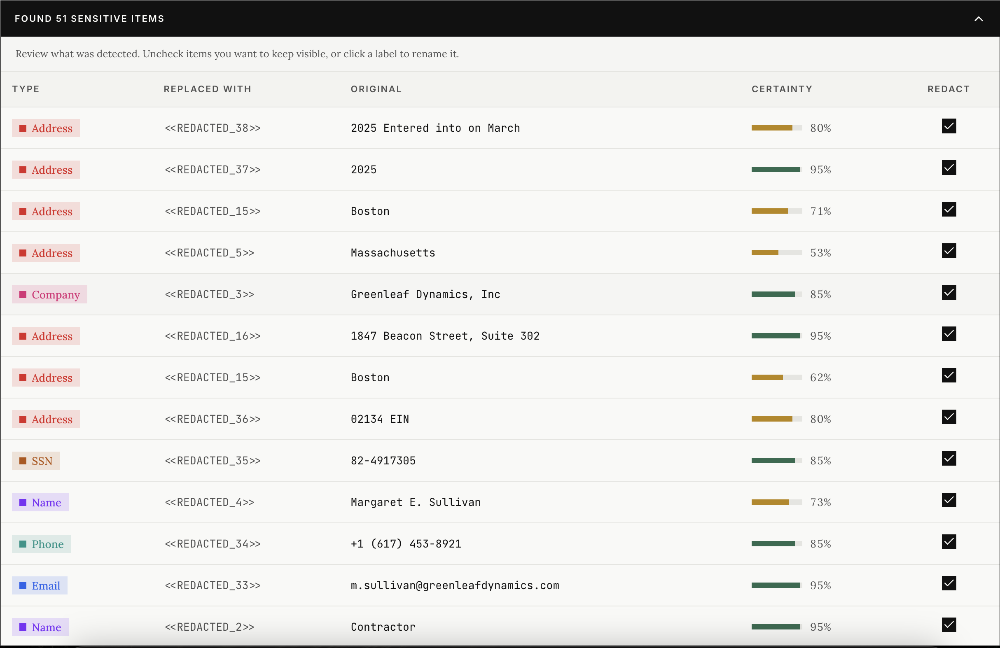
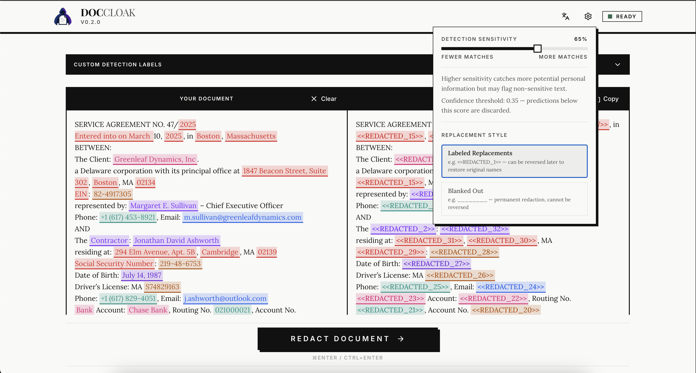

<p align="center">
  
</p>

<h1 align="center">DocCloak</h1>

<p align="center"><strong>Use AI without leaking client data.</strong></p>

[](LICENSE)

DocCloak is an open-source document anonymizer that strips personally identifiable information (PII) before you share documents with AI services - and restores the original names in the AI's response.

Everything runs in your browser. No server, no API calls, no data leaves your machine.


## Who Is This For?

- **Lawyers & legal teams** - redact client names from contracts before asking AI to review clauses
- **Consultants** - anonymize company data in reports before generating AI summaries
- **Healthcare professionals** - strip patient identifiers from notes before using AI for research
- **HR departments** - remove employee PII from documents before AI-assisted policy drafting
- **Anyone** who uses AI tools but handles sensitive data they can't afford to leak

## How It Works

1. **Paste** your document or **upload** a `.doc`/`.docx` file
2. **Redact** - DocCloak detects names, emails, phone numbers, addresses, and other PII using a local ML model + regex patterns
3. **Copy** the anonymized text and paste it into any AI service (ChatGPT, Claude, Gemini, etc.) - or **download** the redacted document
4. **Restore** - paste the AI's response back into DocCloak to replace placeholders with the original names

The AI never sees the real data. You get the full power of AI assistance without the privacy risk.

## Features

- **Runs locally** - ML models run in-browser via ONNX Runtime WebAssembly. Verify: open DevTools → Network tab → zero requests during anonymization



- **12 entity types** - persons, emails, phones, SSNs, credit cards, dates, currencies, IP addresses, IBANs, addresses, companies, and custom labels
- **Document support** - upload `.doc` and `.docx` files, redact PII, and download the protected file with all formatting preserved
- **Multiple detection models** - choose between GLiNER PII Edge (~65 MB, multi-language, custom labels) and BardS.ai EU PII (~279 MB, best for Polish, 35 entity types). Switch models from settings without reloading
- **Hybrid detection** - ML model + 100+ regex rules for structured patterns across European regions (AT, BE, CH, DE, DK, ES, FI, FR, GB, IE, IT, NL, NO, PL, PT, SE)
- **Entity propagation** - when a name or company is detected once, DocCloak automatically finds all other occurrences throughout the document
- **Round-trip de-anonymization** - paste the AI's response back in and DocCloak restores the original names automatically



- **Editable labels** - rename any placeholder (e.g., `<<REDACTED_3>>` → `<<Client_Name>>`) for clearer AI prompts
- **Custom detection labels** - add your own entity types (e.g., `medical condition`, `job title`) to detect domain-specific information
- **Manual tagging** - select any text and assign an entity type for things the model missed



- **Configurable sensitivity** - adjust the confidence threshold to control the precision/recall trade-off
- **8 European languages** - English, Polish, German, French, Spanish, Portuguese, Swedish, Norwegian
- **Replacement styles** - labeled placeholders (`<<REDACTED_N>>`) or blanked out (`________`)



## Getting Started

```bash
# Clone the repository
git clone https://github.com/WLojek/doccloak.git
cd doccloak

# Install dependencies
npm install

# Start development server
npm run dev
```

Open [http://localhost:5173](http://localhost:5173) in your browser.

### Build for Production

```bash
npm run build
npm run preview
```

The output in `dist/` is a static SPA that can be deployed to any static hosting provider (Vercel, Cloudflare Pages, Netlify, etc.) or served locally.

## Tech Stack

| Layer | Choice |
|-------|--------|
| Framework | React 19 |
| Language | TypeScript 5.8 |
| Build | Vite 6 |
| Styling | Tailwind CSS v4 + shadcn/ui (Radix primitives) |
| ML Runtime | ONNX Runtime WebAssembly |
| NER Models | [GLiNER PII Edge v1.0](https://huggingface.co/knowledgator/gliner-pii-edge-v1.0) (~65 MB) / [BardS.ai EU PII](https://huggingface.co/bardsai/eu-pii-anonimization) (~279 MB) |
| Tokenizers | [@huggingface/transformers](https://huggingface.co/docs/transformers.js) v3 (loaded from HuggingFace Hub) |
| Testing | Vitest |

## Why It's Safe

DocCloak doesn't ask you to trust a server, a company, or a privacy policy. It's built so you don't have to trust anyone.

- **Your data never leaves the browser.** There is no backend. No API. No server to get hacked. The ML model and all regex rules run entirely in your browser using WebAssembly. You can verify this yourself: open DevTools → Network tab → paste a document → zero requests.
- **Nothing sensitive is stored.** All entity mappings live in memory only. Close the tab and everything is gone. Only your model preference is saved to localStorage.
- **No tracking, no analytics, no telemetry.** DocCloak doesn't know who you are, what you paste, or how often you use it.
- **Minimal external requests.** The only network activity is loading the app, the ML model, and tokenizer from HuggingFace on first use. No CDN, no Google Fonts, no third-party scripts. No data you paste ever leaves your browser.
- **Open source and auditable.** Every line of code is in this repository. The AGPL-3.0 license guarantees it stays that way - even if someone else hosts it, they must publish their source code too.
- **Works offline after first load.** Once the model is cached, you can disconnect from the internet and DocCloak keeps working — anonymization runs entirely in WebAssembly.

### Model caching and offline use

After a model is downloaded for the first time, DocCloak stores it in the browser's [Cache Storage](https://developer.mozilla.org/en-US/docs/Web/API/Cache) under the `doccloak-models` cache. On subsequent visits the model loads from local storage instead of re-downloading from HuggingFace, so you can use DocCloak fully offline.

Caching is **best-effort**. If your browser refuses to cache the model — for example because the per-origin storage quota is exceeded, you're using an Incognito/Private window with restricted quota, or the model file is larger than the browser allows for a single Cache entry — DocCloak still loads the model into memory and works normally for the current session. The next visit will simply re-download it instead of using the cache.

The BardS.ai EU PII model (~279 MB) is most likely to hit quota limits, especially in Incognito mode. GLiNER PII Edge (~65 MB) caches reliably almost everywhere. To force a re-download (e.g. after a model update), open DevTools → Application → Cache Storage → delete the `doccloak-models` cache.

## Scripts

```bash
npm run dev        # Start dev server
npm run build      # Type-check + production build
npm run preview    # Preview production build
npm run lint       # Run ESLint
npm test           # Run tests
npm run test:watch # Run tests in watch mode
```

## Contributing

Contributions are welcome! Whether it's adding regex rules for new regions, improving detection accuracy, fixing bugs, or translating the UI - all help is appreciated.

1. Fork the repository
2. Create a feature branch (`git checkout -b feature/my-feature`)
3. Make your changes and ensure tests pass (`npm test`)
4. Submit a pull request

## License

[AGPL-3.0](LICENSE)
